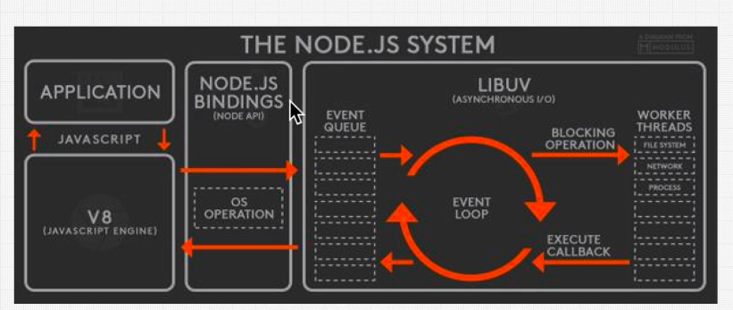

# NodeJs
THis repo contains all code for my node learning

## NODE_IS_BORN

- 1995 NETSCAPE IS BORN
- 2008 GOOGLE ANNOUNCED CHROME BROWSER WITH V8 ENGINGE
- 2009 NODEJS WAS CREATED , it took same v8 engine and used it to run outside browser.

## JS_Runtime

- Node is a JS runtime, its not a programming language.
- Its give environment to run JS
- In order to do more than JS which is not part of JS langiage then `libuv` comes.
- Whatever which is not part of JS then it takes help of `libuv` library.
- A binding was created between V8 engine and the libuv.
- A web browser is also a JS runtime.
- [How JS works in browser](https://medium.com/jspoint/how-javascript-works-in-browser-and-node-ab7d0d09ac2f)
  
  

